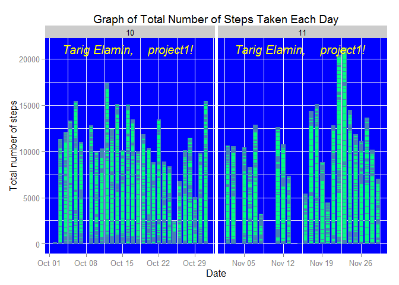
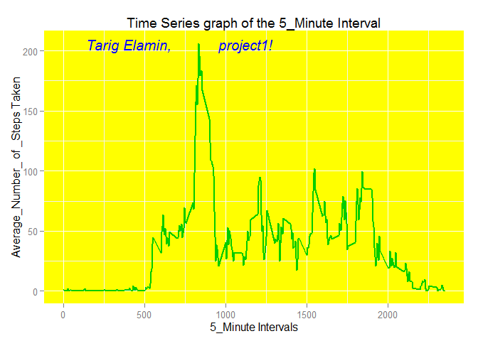
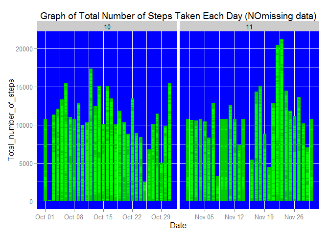
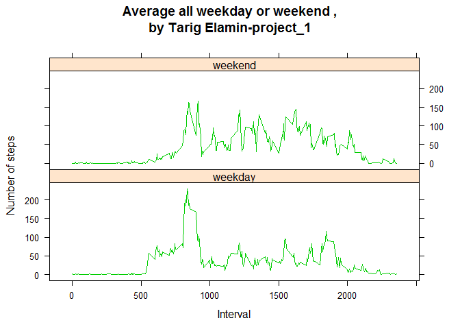

<table>
<colgroup>
<col width="4%" />
</colgroup>
<tbody>
<tr class="odd">
<td align="right"><strong>Data Science Specialization</strong> Winter 2015</td>
</tr>
<tr class="even">
<td align="right"><strong>Reproduciable Research Course</strong></td>
</tr>
<tr class="odd">
<td align="right">*****Assignment_1****************</td>
</tr>
<tr class="even">
<td align="right">by <strong>Tarig Elamin</strong>***</td>
</tr>
</tbody>
</table>

**in this assignment our plan is to answer the following questions:**

1.  What is mean total number of steps taken per day?

2.  What is the average daily activity pattern?

3.  Which 5-minute interval, on average across all the days in the
    dataset,

contains the maximum number of steps?

1.  Do these values differ from the estimates from the first part of the

assignment?

1.  What is the impact of imputing

##### data access

The data downloaded from this link:

<https://d396qusza40orc.cloudfront.net/repdata%2Fdata%2Factivity.zip>

and then unzipped in our working directory.Then, in the following steps
below

,R program code is built and run to find out about the answers.

                   **working directory** 

C://Users//abdu//Desktop//data\_science//reproducible research course

* * * * *

    activ <- read.csv("C://Users//abdu//Desktop//data_science//reproducible research course//activity.csv" ,colClasses = c("integer", "Date", "factor"))
    activ$month <- as.numeric(format(activ$date, "%m"))
    # ignoring the missing observations in this stage of analysis
    noNA<- na.omit(activ)
    rownames(noNA) <- 1:nrow(noNA )
    head(noNA)

    ##   steps       date interval month
    ## 1     0 2012-10-02        0    10
    ## 2     0 2012-10-02        5    10
    ## 3     0 2012-10-02       10    10
    ## 4     0 2012-10-02       15    10
    ## 5     0 2012-10-02       20    10
    ## 6     0 2012-10-02       25    10

    dim(noNA)

    ## [1] 15264     4

    library(ggplot2)

\*\* For the mean total number of steps taken per day and the median as
well,\*\*

**the R code is below**

    library(ggplot2)
    library(gridExtra)

    ## Loading required package: grid

    my_grob = grobTree(textGrob("Tarig Elamin,    project1!", x=0.1,  y=0.95, hjust=0,
      gp=gpar(col="yellow", fontsize=15, fontface="italic")))
    z<-ggplot(noNA, aes(date, steps)) + geom_bar(stat = "identity", colour = "steelblue", fill = "springgreen", width = 0.7) + facet_grid(. ~ month, scales = "free") + labs(title = "Graph of Total Number of Steps Taken Each Day", x = "Date", y = "Total number of steps")+annotation_custom(my_grob)
    z + theme(panel.background = element_rect(fill = "blue"))

    totalSteps <- aggregate(noNA$steps, list(Date = noNA$date), FUN = "sum")$x
    mean(totalSteps)

    ## [1] 10766.19

    median(totalSteps)

    ## [1] 10765

\*\* resulting in :the mean total number of steps taken per day =
**10766.19**

\*\* resulting in :the median total number of steps taken per day =
**10765**

* * * * *

**let's find out about the average daily activity pattern:**

    avgSteps <- aggregate(noNA$steps, list(interval = as.numeric(as.character(noNA$interval))), FUN = "mean")
    names(avgSteps)[2] <- "meanOfSteps"
    library(gridExtra)
    my_grob = grobTree(textGrob("Tarig Elamin,           project1!", x=0.1,  y=0.95, hjust=0,
      gp=gpar(col="blue", fontsize=15, fontface="italic")))
    w<-ggplot(avgSteps, aes(interval, meanOfSteps)) + geom_line(color = "green3", size = 0.8) + labs(title = "Time Series graph of the 5_Minute Interval", x = "5_Minute Intervals", y = "Average_Number_ of _Steps Taken")+
      annotation_custom(my_grob)
    w + theme(panel.background = element_rect(fill = "yellow"))

* * * * *

Across all the days in the activity dataset -on average,the 5\_minute
interval

, containing the maximum number of steps can be seen from this code
below

    avgSteps[avgSteps$meanOfSteps == max(avgSteps$meanOfSteps), ]

    ##     interval meanOfSteps
    ## 104      835    206.1698

so with the corresponding interval,the average of steps is turned out to
be =**206.1698**

* * * * *

missing data represents a big problem if we attend to a regression model
for

example but first of all let's find out about the total number of
missing

observations/rows and decide which approach one can use to impute the
missing

data(one can select the mean or median or zero or a constant).Let's
select

the mean to impute our missing values.

    sum(is.na(activ))

    ## [1] 2304

#### the mean of 5\_minute interval to replace the missing values in the new

#### data:

    newData <- activ 
    for (i in 1:nrow(newData)) {
        if (is.na(newData$steps[i])) {
            newData$steps[i] <- avgSteps[which(newData$interval[i] == avgSteps$interval), ]$meanOfSteps
        }
    }

    head(newData)

    ##       steps       date interval month
    ## 1 1.7169811 2012-10-01        0    10
    ## 2 0.3396226 2012-10-01        5    10
    ## 3 0.1320755 2012-10-01       10    10
    ## 4 0.1509434 2012-10-01       15    10
    ## 5 0.0754717 2012-10-01       20    10
    ## 6 2.0943396 2012-10-01       25    10

    sum(is.na(newData))

    ## [1] 0

* * * * *

1.  **graph of the total number of steps taken each day**
2.  **Mean total number of steps taken per day**
3.  **Median total number of steps taken per day**

can be seen, below, for the new data that has no missing values:

    library(ggplot2)
    ww<-ggplot(newData, aes(date, steps)) + geom_bar(stat = "identity",
                                                 colour = "green3",
                                                 fill = "green",
                                                 width = 0.7) + facet_grid(. ~ month, scales = "free") + labs(title = "Graph of Total Number of Steps Taken Each Day (NOmissing data)", x = "Date", y = "Total_number_of_steps")
    ww+theme(panel.background = element_rect(fill = "blue"))

**Looking for mean and median of the old activ data(the one have
missing**

**values)against the new data that has nomissing.**

============================================================================

    newTotalSteps <- aggregate(newData$steps, 
                               list(Date = newData$date), 
                               FUN = "sum")$x
    newMean <- mean(newTotalSteps)
    newMean

    ## [1] 10766.19

    newMedian <- median(newTotalSteps)
    newMedian

    ## [1] 10766.19

    oldMean <- mean(totalSteps)
    oldMedian <- median(totalSteps)
    newMean - oldMean

    ## [1] 0

    newMedian - oldMedian

    ## [1] 1.188679

Noting that there is no difference between the old comparing to the new
mean

,but the new median is bigger than the old median.

* * * * *

*The differences-if any- in activity patterns between weekdays and
weekends*

    head(newData)

    ##       steps       date interval month
    ## 1 1.7169811 2012-10-01        0    10
    ## 2 0.3396226 2012-10-01        5    10
    ## 3 0.1320755 2012-10-01       10    10
    ## 4 0.1509434 2012-10-01       15    10
    ## 5 0.0754717 2012-10-01       20    10
    ## 6 2.0943396 2012-10-01       25    10

    newData$weekdays <- factor(format(newData$date, "%A"))
    levels(newData$weekdays)

    ## [1] "Friday"    "Monday"    "Saturday"  "Sunday"    "Thursday"  "Tuesday"  
    ## [7] "Wednesday"

    levels(newData$weekdays) <- list(weekday = c("Monday", "Tuesday",
                                                 "Wednesday", 
                                                 "Thursday", "Friday"),
                                     weekend = c("Saturday", "Sunday"))
    levels(newData$weekdays)

    ## [1] "weekday" "weekend"

    table(newData$weekdays)

    ## 
    ## weekday weekend 
    ##   12960    4608

* * * * *

**The time series panel plot the 5\_minute interval and the average
number**

\*\* of steps taken averaged across all weekday days or weekend days
.\*\*

    avgSteps <- aggregate(newData$steps, 
                          list(interval = as.numeric(as.character(newData$interval)), 
                               weekdays = newData$weekdays),
                          FUN = "mean")
    names(avgSteps)[3] <- "meanOfSteps"
    library(lattice)
    xyplot(avgSteps$meanOfSteps ~ avgSteps$interval |avgSteps$weekdays, 
            layout = c(1, 2), type = "l",
           xlab = "Interval", ylab = "Number of steps",main="Average all weekday or weekend ,\nby Tarig Elamin-project_1",pch=19,col="green3")

                                 **Appendix:*

**data definition:**

*variable name:definition*

1.  steps: Number of steps taking in a 5-minute interval (missing values
    are

coded

as NA)

1.  date: The date on which the measurement was taken in YYYY-MM-DD
    format

2.  interval: Identifier for the 5-minute interval in which measurement
    was

taken

                            ** The End **
